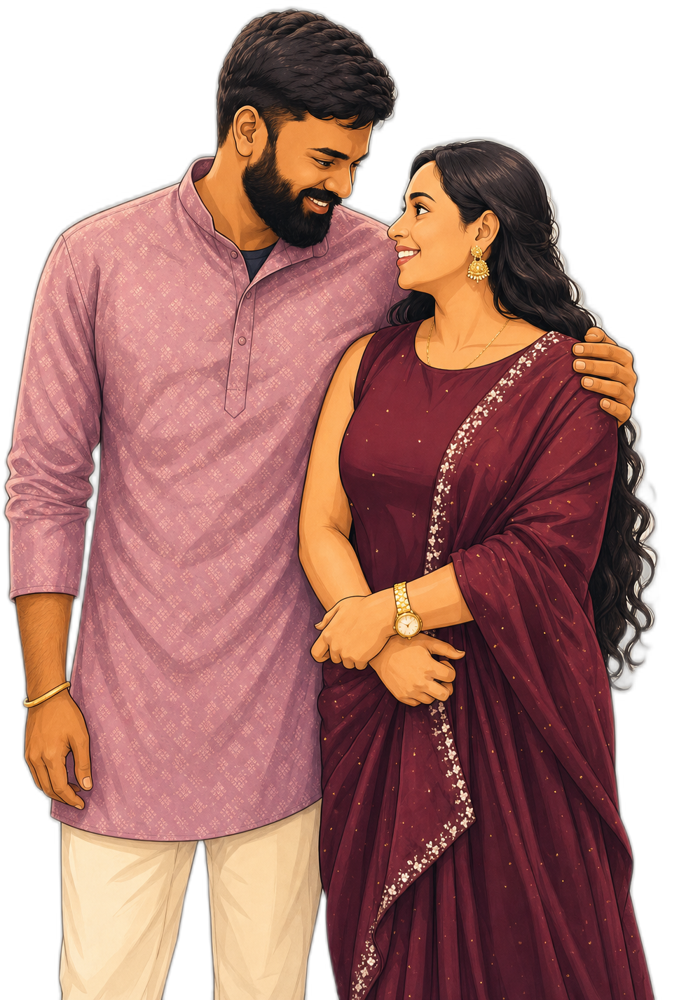

# Abin & Shilpa — Engagement Invitation

An elegant single-page invitation for the engagement of **Abin Thomas C T** and **Shilpa Susan Mathew**.

- **When:** Saturday, 8 August 2026, 12:00 PM
- **Where:** Parish Hall, St. Mary's Jacobite Syrian Cathedral, Manarcad

## Enable GitHub Pages

1. Push this repository to GitHub.
2. Go to **Settings → Pages**.
3. Under **Build and deployment**, set **Source** to **Deploy from a branch**.
4. Choose branch **`main`** and folder **`/ (root)`**, then **Save**.
5. Wait a minute and open the published URL shown on that page.

## Files

- `index.html` — page content
- `styles.css` — theme and layout
- `script.js` — countdown timer, scroll animations, floating petals
- `couple-hero.png` — the transparent cut-out shown in the hero (currently a copy of `hero-B1.png`)
- `hero-A.png`, `hero-B1.png`, `hero-B2.png`, `hero-B3.png` — transparent hero cut-out options (see below)
- `hero-B1-raw.png`, `hero-B2-raw.png`, `hero-B3-raw.png` — the generated illustrations before background removal
- `couple-illustration.png`, `couple-illustration-2.png` — earlier alternate generated illustrations
- `edited.jpeg`, `original_edited.jpeg` — source illustrations used for the cut-outs
- `photo1–4.jpeg` — couple photos (photo2–4 used in the gallery)
- `.nojekyll` — serves the files as-is (no Jekyll processing)

## Choosing the hero image

Four transparent cut-outs are included so you can pick your favourite:

- `hero-A.png` — exact faces from `original_edited.jpeg`; man's left arm stays slightly cropped at the edge
- `hero-B1.png` — regenerated, three-quarter framing, complete left arm (current default)
- `hero-B2.png` — regenerated alternate, three-quarter framing, complete left arm
- `hero-B3.png` — regenerated full-length (feet visible), complete left arm

To switch, edit the hero `img` in `index.html` and point `src` at the file you want:

```html

```

(Or overwrite `couple-hero.png` with your chosen file.) The full-length `hero-B3.png` may need a small tweak to `.hero__photo` `max-width` / the bottom `mask-image` fade in `styles.css`.

No build step or dependencies are required — it is a static site.
